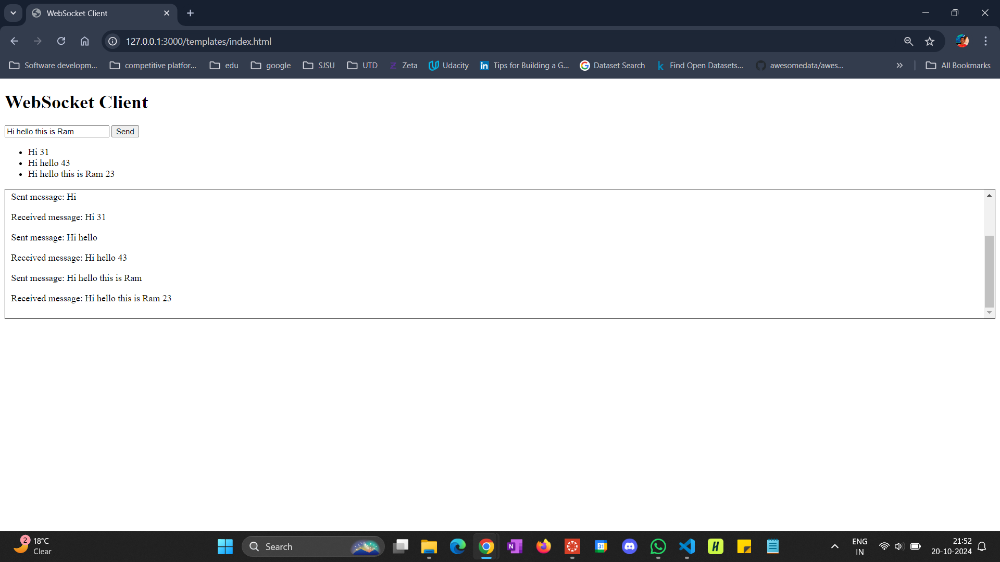

# Description
WebSocket is a standard protocol that enables a web browser or client application and a web server application to communicate by using one full duplex connection.

HTTP was not designed for long-lived, real-time, full duplex communication between two applications. In many instances, a user's web server application or servlet wants to communicate with a client browser or application in a long-lived, real-time, full duplex conversation. In other words, the two applications want to freely read and write data back and forth. An example of this type of application is GPT Chat interface that constantly displays responses to prompt from the User Interface. Current solutions that involve existing HTTP technology to accomplish this type of communication are cumbersome and inefficient. HTTP solutions, for constant two-way communication between a browser and a server, mostly consists of either polling or two open HTTP connections that handle one-way traffic only, or both.

WebSocket uses a standard HTTP request-response sequence to establish a connection. When the connection is established, the WebSocket API provides a read and write interface for reading and writing data over the established connection in an asynchronous full duplex manner. WebSocket also provides an interface for asynchronously closing the connection from either side.

## assignment is to:
1.install Web Sockets (pip install WebSocket)  and run web socket Server. 
2.Modify the incoming message from client to append a random number to client message in the server and return back to client.  
3.run client 10000 times and see no web socket message is dropped. 
4.Add User Interface to the application.

## screenshots:

WebSocket Server Running:

Web User Interface:

